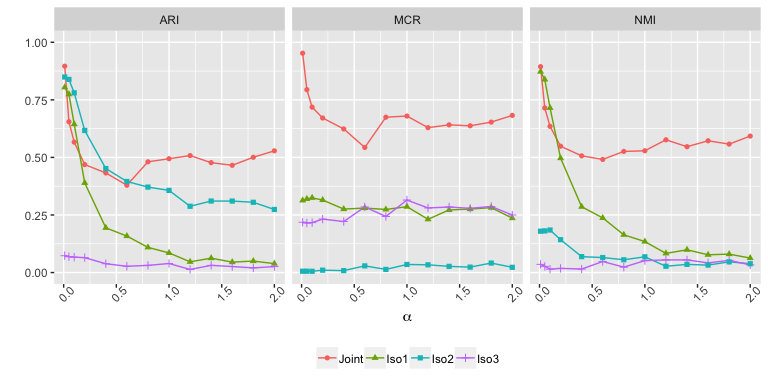
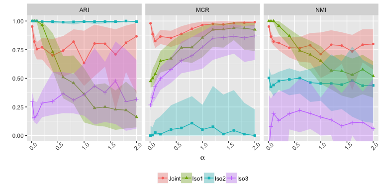

Some additional results
================

### Realignment analysis and additional measures

Here, we include experiments using additional realignment steps (Iso2 and Iso3), and also two additional cluster retrieval performance measures: ARI and misclutering rate (MCR).

### Summary of realignment procedures

#### Iso1

1.  Rank diag(*θ**n*)
2.  Re-order *X**n* and *θ**n* accordintly

#### Iso2

1.  Cluster the centers
2.  Re-assign nodes to clusters based on the center of the centers

#### Iso3

1.  Search over all permutation to make all *W**n* as close as possible
2.  Re-order *X**n* and *θ**n* accordintly

### Results

#### Overall NMI

#### Individual NMI

